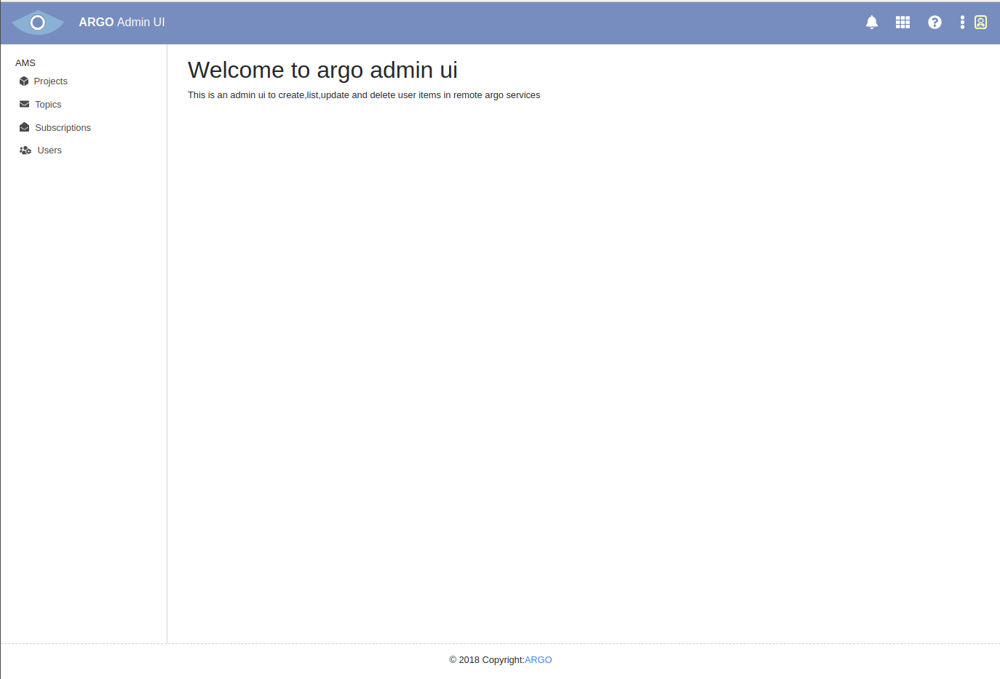

# argo-admin-ui
__Argo Admin UI__

Web-UI proof-of-concept (based on React) for managing users in Argo services.

Project bootstrapped using __create-react-app__ tool ([more info](https://github.com/facebook/create-react-app))

## Install

Make sure you have the following versions of `nodejs` and `npm` installed in your local environment

Requirements:
- nodejs: v8.12.0
- npm: 6.4.1

Steps:
1) `git clone github.com/ARGOeu/argo-admin-ui`
2) `cd argo-admin-ui`
3) `npm install`  -- _this will get the required dependencies (along with `create-react-app`) and store them in `./node_modules/` folder_

## Run 
Steps:
1) `npm start`
2) direct your browser to `locahost:3000` 

## Test
Steps:
1) `npm run test` -- _this will start the interactive tester_
2)  press `a` to run all tests
3)  press `q` to quit testing

## Build
Steps:
1) `npm run build` -- _this will produce the deployable package in `./build` folder_